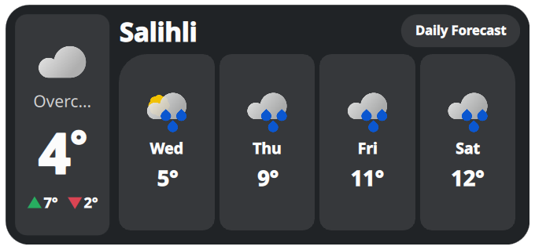
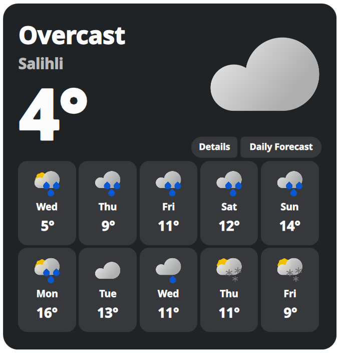
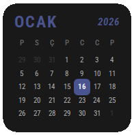
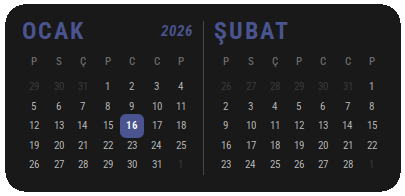
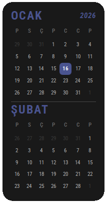
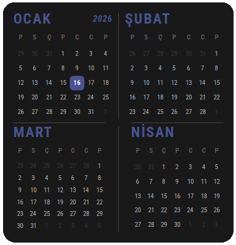
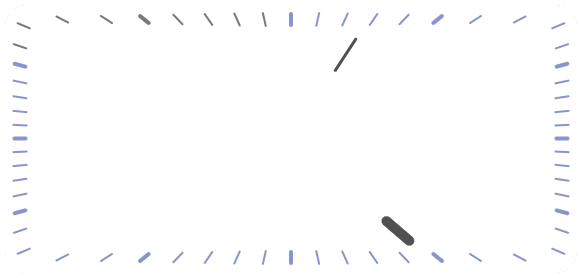

<p align="center">
  
</p>

<h1 align="center">KDE Plasma 6 Widget Collection</h1>

<p align="center">
  <b>A modern, highly customizable, and unified collection of widgets for KDE Plasma 6.</b>
</p>

<p align="center">
  <a href="#-installation"></a>
  <a href="./LICENSE"></a>
  <a href="#-widget-catalog"></a>
  <a href="#-key-features"></a>
</p>

<p align="center">
  <a href="#-key-features">Features</a> •
  <a href="#-widget-catalog">Widgets</a> •
  <a href="#-installation">Installation</a> •
  <a href="#%EF%B8%8F-configuration">Configuration</a> •
  <a href="#-contribution">Contribute</a>
</p>

---

## 📖 Overview

This repository contains a suite of plasmoids ranging from advanced system tools (**File Search**, **System Monitor**) to essential desktop utilities (**Clock**, **Calendar**, **Notes**), all re-engineered for **performance**, **visual consistency**, and **ease of use**.

> ⭐ **If you find this collection useful, please consider starring the repository!**

---

## ✨ Key Features

| Feature | Description |
|---------|-------------|
| 🎨 **Plasma 6 Native** | Built fully on Qt6 and QML, optimized for the latest KDE Plasma desktop. |
| 🎯 **Unified Design** | All widgets share a consistent look using system theme icons (`breeze-icons`). |
| 🌍 **20 Languages** | Advanced JSON-based localization supporting English, Turkish, German, French, Spanish, Russian, Portuguese, Italian, Japanese, Czech, Greek, Azerbaijani, Armenian, Romanian, Hindi, Bengali, Urdu, Indonesian, Persian, and Chinese. |
| 🧩 **Modular Architecture** | Clean code with reusable components and logic separated into JavaScript modules. |
| ⚡ **Power User Features** | Smart Query in File Finder, dynamic MPRIS discovery, offline-first Calendar, and more. |

---

## 📦 Widget Catalog

### 🔍 File Finder
> A powerful **Spotlight/Raycast** alternative for Plasma.

- **Smart Query**: Understands KRunner prefixes (`timeline:/today`, `gg:`, `kill`, `units`)
- **View Profiles**: Minimal, Developer (with live telemetry), and Power User modes
- **Rich Previews**: Instant hover previews with async thumbnail caching
- 📄 *[Read detailed documentation →](./file-search/README.md)*

### 🌦️ Weather
> A responsive, multi-provider weather dashboard with stunning animations.

<p align="center">
  
  
  
</p>

- **Adaptive Layouts**: Morphs between Small, Wide (Card), and Large (Grid) modes
- **Morphing Details**: Unique overlay that expands smoothly from UI elements
- **Zero Config**: Works out-of-the-box with Open-Meteo (no API key required)
- 📄 *[Read detailed documentation →](./weather/README.md)*

### 🎵 Music Player
> A dynamic media controller that adapts to your workflow.

- **Universal Control**: Automatically finds active media players (Spotify, VLC, browser, etc.)
- **Smart Discovery**: Scans all active MPRIS services
- **Visual Polish**: Squeeze animations, dynamic pill-shaped badge, themed icons

### 🗓️ MCalendar
> A clean, offline-focused calendar widget.

<p align="center">
  
  
  
  
</p>

- **Privacy-First**: No external dependencies for a fast, local experience
- **System Integration**: Uses system locale for date formats
- **Modern UI**: Fluid animations and improved event markers
- 📄 *[Read detailed documentation →](./calendar/README.md)*

### 🔋 Battery
> A multi-device power monitor.

- **Peripheral Support**: Up to 4 devices (Mouse, Keyboard, Headphones, etc.)
- **Dynamic UI**: Charging indicators adapt to available space

### ⏰ Clocks
> Analog & Digital clock widgets.

<p align="center">
  
  
</p>

- **Analog**: Minimalist design with dynamic opacity and hand smoothing
- **Digital**: Configurable fonts (Roboto Condensed Variable) and hover-reveal seconds

### 🔄 Advanced Reboot
> Power management with granular control.

- **Boot Options**: List and select UEFI/BIOS entries directly (requires `bootctl`)
- **Safe UI**: Confirmation interface to prevent accidental actions

### 🛠️ Other Utilities

| Widget | Description |
|--------|-------------|
| **System Monitor** | CPU, RAM, and Disk visualization |
| **Notes** | List-based notes with drag-and-drop reordering |
| **Control Center** | Quick toggles for system settings |
| **AUR Updates** | (Arch Linux) Update monitoring |
| **World Clock** | Multiple timezone display |
| **Photos** | Photo frame widget |
| **Spotify** | Dedicated Spotify controller |
| **Events** | Event reminder widget |
| **Alarms** | Alarm clock widget |


---


## 🚀 Installation

### Prerequisites

```bash
# Required packages
kpackagetool6      # Plasma widget installer
plasmawindowed     # For standalone testing (optional)
```

### Quick Install (Recommended)

```bash
# Clone the repository
git clone https://github.com/MCC45TR/Plasma6Widgets.git
cd Plasma6Widgets

# Install all widgets
chmod +x install_all.sh
./install_all.sh
```

### Install Single Widget

```bash
# Install and test a specific widget
./install_all.sh weather
```

### Manual Installation

```bash
cd widget-directory-name
kpackagetool6 --type Plasma/Applet --install .

# To update an existing widget:
kpackagetool6 --type Plasma/Applet --upgrade .
```

---

## ⚙️ Configuration

Most widgets have a rich configuration panel accessible via **Right Click → Configure**.

| Widget | Configuration Options |
|--------|----------------------|
| **File Search** | View Profile (Minimal/Developer/Power User), Search History |
| **Music Player** | Default player selection |
| **Weather** | Provider selection, Location, Units, Icon Pack |
| **Clocks** | Font, Size, Format options |

---

## 🐛 Troubleshooting

<details>
<summary><b>Widget not showing after install?</b></summary>

Restart the Plasma shell:
```bash
systemctl --user restart plasma-plasmashell
```
Or log out and log back in.
</details>

<details>
<summary><b>"Error loading QML"?</b></summary>

Check real-time logs:
```bash
journalctl --user -f -g plasmashell
```
</details>

<details>
<summary><b>Missing Icons?</b></summary>

Ensure you have `breeze-icon-theme` or a compatible system icon theme installed.
</details>

---

## 🤝 Contribution

Contributions are welcome! Please follow these guidelines:

1. **Localization**: Add new strings to `localization.json` in the widget's `contents/ui/` folder
2. **Icons**: Prefer system icons over local assets
3. **Versioning**: Update `metadata.json` version when making changes

---

## 📄 License

This project is licensed under the **GPL-3.0 License** - see the [LICENSE](./LICENSE) file for details.

---

<p align="center">
  <b>Maintained with ❤️ by <a href="https://github.com/MCC45TR">MCC45TR</a></b>
</p>

<p align="center">
  <sub>Note: AI tools were used in the development of this project.</sub>
</p>
