<p align="center">
  
</p>

<h1 align="center">KDE Plasma 6 Widget Collection</h1>

<p align="center">
  <b>A modern, highly customizable, and unified collection of widgets for KDE Plasma 6.</b>
</p>

<p align="center">
  <a href="#installation"></a>
  <a href="./LICENSE"></a>
  <a href="#widget-catalog"></a>
  <a href="#key-features"></a>
</p>

<p align="center">
  <a href="#key-features">Features</a> •
  <a href="#widget-catalog">Widgets</a> •
  <a href="#installation">Installation</a> •
  <a href="#configuration">Configuration</a> •
  <a href="#troubleshooting">Troubleshooting</a> •
  <a href="#contributing">Contributing</a>
</p>

---

## Overview

This repository contains a suite of plasmoids ranging from advanced system tools (**File Search**, **MSI Control**, **System Monitor**) to essential desktop utilities (**Clock**, **Calendar**, **Weather**, **Notes**), all engineered for **performance**, **visual consistency**, and **ease of use**.

> **If you find this collection useful, please consider starring the repository!**

---

## Key Features

| Feature | Description |
|---------|-------------|
| **Plasma 6 Native** | Built fully on Qt6 and QML, optimized for the latest KDE Plasma desktop. |
| **Unified Design** | All widgets share a consistent look using system theme icons (`breeze-icons`). |
| **Localization** | Standard Gettext-based localization (`.po`/`.mo`) supporting 20+ languages including English, Turkish, German, French, Spanish, Russian, Portuguese, and Italian. |
| **Modular Architecture** | Clean code with reusable components and logic separated into JavaScript modules. |
| **Power User Features** | Smart Query in File Search, dynamic MPRIS discovery, offline-first Calendar, hardware control for MSI laptops, and more. |
| **Unified Installer** | A single script installs, updates, and test-launches any widget, with dry-run and translation compilation support. |

---

## Widget Catalog

### MFile Search `v1.3.1`
> A powerful **Spotlight/Raycast** alternative for Plasma.

<p align="center">
  
  
  
  
  
  
  <br>
  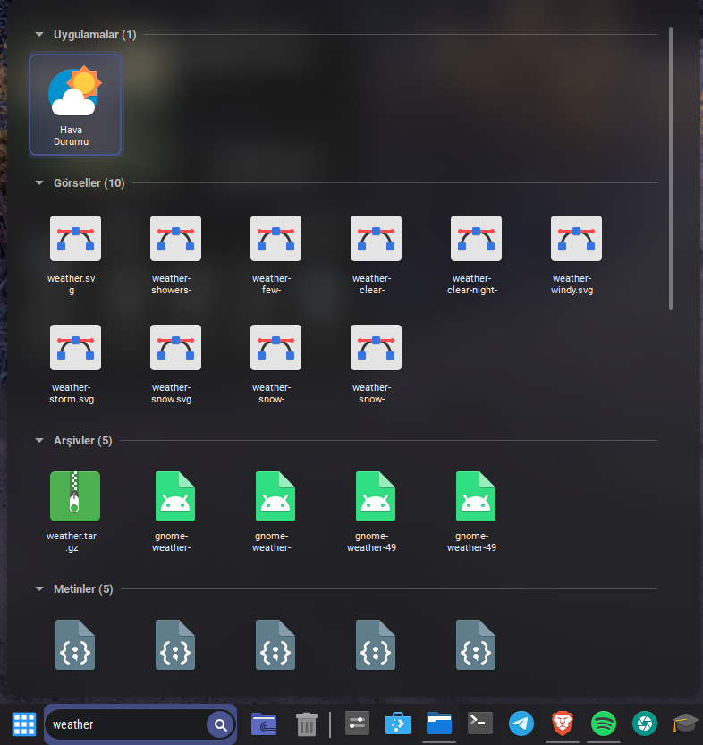
</p>

- **Smart Query**: Understands KRunner prefixes (`timeline:/`, `gg:`) with **interactive hint buttons**
- **Pinned Items**: Pin favorite apps or files to the top for instant access
- **Customizable Appearance**: Select corner radius (Square to Round) and adjust panel height (18–96 px)
- **View Profiles**: Minimal, Developer (with live telemetry), and Power User modes
- **Rich Previews**: Instant hover previews with async thumbnail caching
- **Localized**: Full support for 20 languages including interactive prefix suggestions
- *[Read detailed documentation](./file-search/README.md)*

### MWeather `v1.2.2`
> A responsive, multi-provider weather dashboard with fluid animations.

<p align="center">
  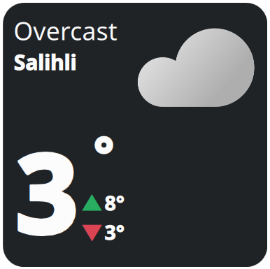
  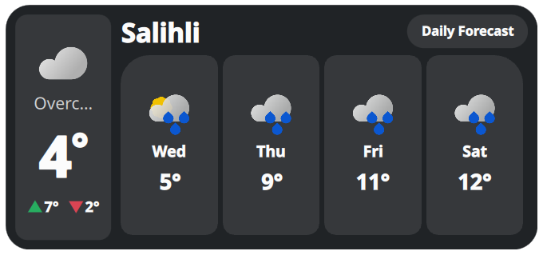
  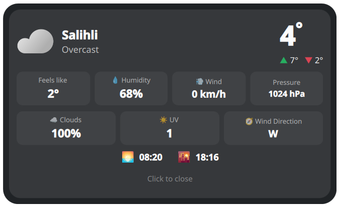
  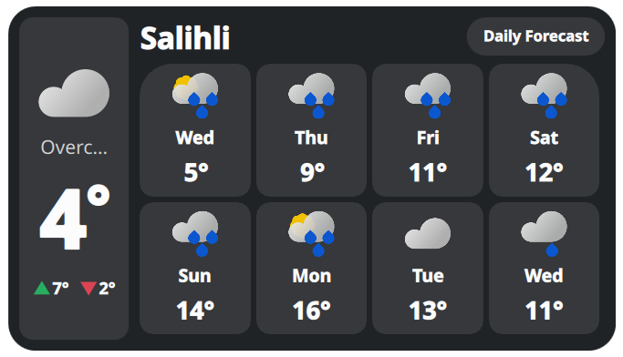
  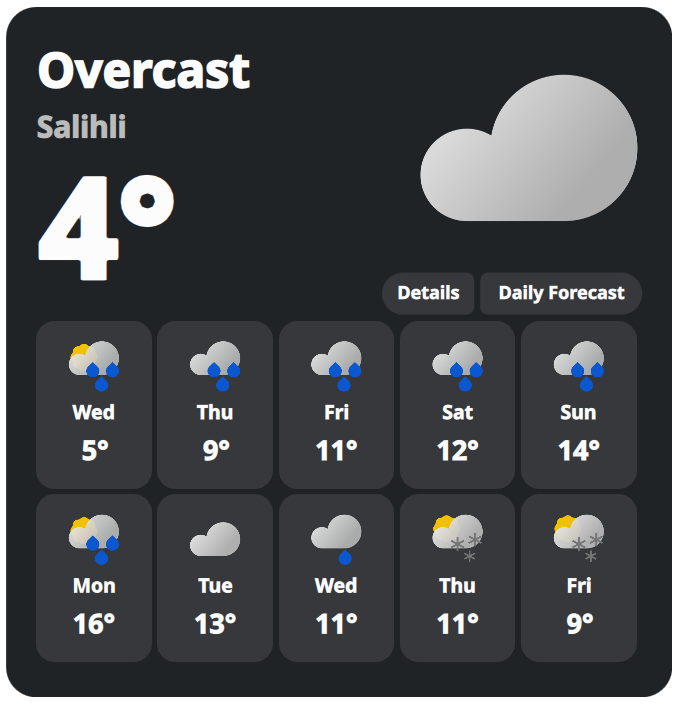
</p>

- **Adaptive Layouts**: Morphs between Small, Wide (Card), and Large (Grid) modes
- **Morphing Details**: Unique overlay that expands smoothly from UI elements
- **Automatic Location**: Detects your location without manual configuration
- **Widget Edge Margin**: Customizable margins (Normal, Less, None) for better panel integration
- **Zero Config**: Works out of the box with Open-Meteo (no API key required)
- *[Read detailed documentation](./weather/README.md)*

### MMusic Player `v1.2.6`
> A dynamic media controller that adapts to your workflow.

<p align="center">
  
  
  <br>
  
</p>

- **Universal Control**: Automatically finds active media players (Spotify, VLC, browsers, etc.)
- **Smart Discovery**: Scans all active MPRIS services in real time
- **Visual Polish**: Squeeze animations, dynamic pill-shaped badge, themed icons
- *[Read detailed documentation](./music-player/README.md)*

### MCalendar `v1.6`
> A clean, offline-focused calendar widget.

<p align="center">
  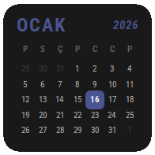
  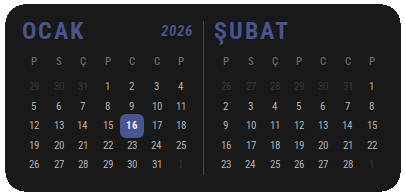
  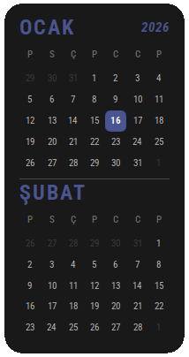
  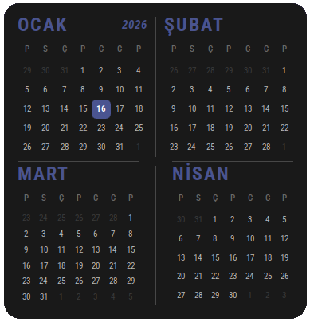
</p>

- **Privacy-First**: No external dependencies for a fast, local experience
- **System Integration**: Uses the system locale for date formats
- **Modern UI**: Fluid animations and improved event markers
- *[Read detailed documentation](./calendar/README.md)*

### MAnalog Clock `v1.3.1`
> A sophisticated minimal analog clock with adaptive squircle layout.

<p align="center">
  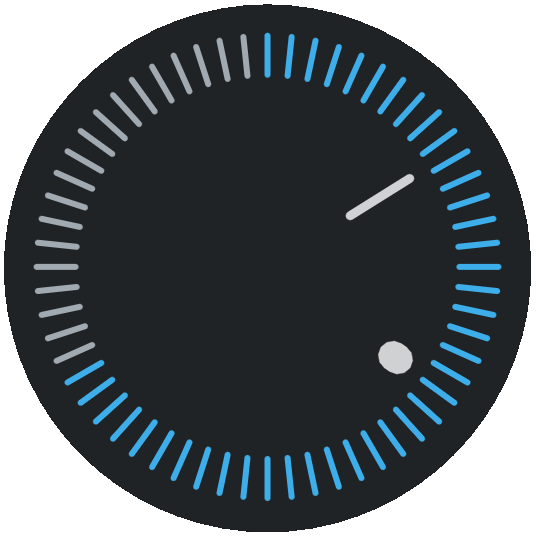
  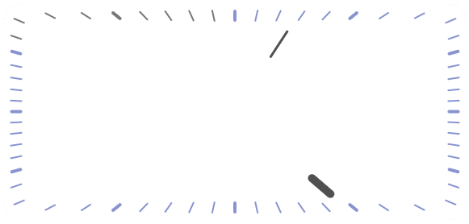
  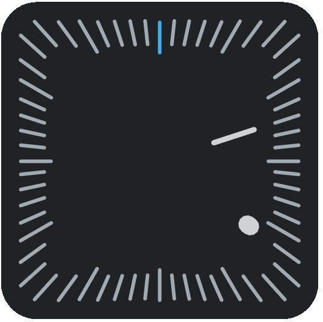
  <br>
  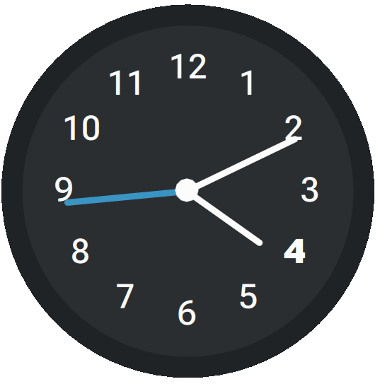
  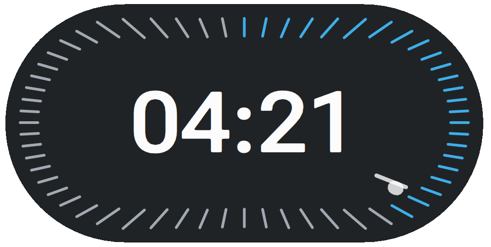
</p>

- **Minimalist Design**: Dynamic opacity and smooth hand movement
- **Adaptive Layout**: Squircle geometry that scales with the widget size

### MBrowser Search `v1.1.0`
> A minimalist browser search bar with quick access to history and settings.

- **Multi-Engine**: Support for Google, DuckDuckGo, Bing, and more
- **Quick Access**: Dedicated buttons for incognito mode, new tab, and browser history
- **Widget Edge Margin**: Adjustable spacing for a perfect panel fit
- *[Read detailed documentation](./browser-search/README.md)*

### MBattery `v1.0.3`
> A multi-device power monitor.

- **Peripheral Support**: Up to 4 Bluetooth devices (mouse, keyboard, headphones, etc.)
- **Dynamic UI**: Charging indicators adapt to available space and use dynamic icons

### MSelective Reboot `v1.1`
> Power management with granular control.

- **Boot Options**: List and select UEFI/BIOS boot entries directly (requires `bootctl`)
- **Safe UI**: Confirmation interface to prevent accidental actions

### MSI Control Center `v1.0.0`
> A premium control center for MSI laptops.

- **Hardware Control**: Temperatures, fan curves, and shift modes via the `msi-ec` kernel module
- **Native Look**: Follows the Plasma theme for seamless desktop integration

### AFAD Earthquake Reports `v1.0`
> Live earthquake monitoring for Türkiye.

- **Official Data**: Lists earthquakes reported by AFAD (Disaster and Emergency Management Authority of the Republic of Türkiye)

### Dynamic Color Scheme `v1.0`
> Automated desktop theming.

- **Time-Based Switching**: Automatically switches Plasma color schemes and Konsole profiles based on the time of day

### Other Utilities

| Widget | Description |
|--------|-------------|
| **App Menu** | Modern app menu with pinned apps and an app library |
| **Digital Clock** | Configurable digital clock with hover-reveal seconds |
| **Minimal Analog Clock** | Ultra-minimal analog clock variant |
| **System Monitor** | CPU, RAM, and disk visualization |
| **Notes** | List-based notes with drag-and-drop reordering |
| **Control Center** | Quick toggles for system settings |
| **AUR Updates** | Update monitoring for Arch Linux |
| **World Clock** | Multiple timezone display |
| **Photos** | Photo frame widget |
| **Spotify** | Dedicated Spotify controller |
| **Events** | Event reminder widget |
| **Alarms** | Alarm clock widget |

---

## Installation

### Prerequisites

```bash
# Required packages
kpackagetool6      # Plasma widget installer
plasmawindowed     # For standalone testing (optional)
```

### Quick Install (Recommended)

```bash
# Clone the repository
git clone https://github.com/MCC45TR/Plasma6Widgets.git
cd Plasma6Widgets

# Install all widgets
./install_all.sh
```

### Installer Options

The installer supports selective installation, test launches, and dry runs:

```bash
./install_all.sh --list                # List all available widgets
./install_all.sh weather battery      # Install specific widgets only
./install_all.sh --test weather       # Install AND launch in a test window
./install_all.sh --dry-run file-search # Preview planned actions without installing
./install_all.sh --no-translations    # Skip .po -> .mo compilation
```

### Manual Installation

```bash
cd <widget-directory>
kpackagetool6 --type Plasma/Applet --install .

# To update an existing widget:
kpackagetool6 --type Plasma/Applet --upgrade .
```

---

## Configuration

Most widgets have a rich configuration panel accessible via **Right Click → Configure**.

| Widget | Configuration Options |
|--------|----------------------|
| **File Search** | View profile (Minimal / Developer / Power User), search history, corner radius, panel height |
| **Weather** | Provider selection, location (manual or automatic), units, icon pack |
| **Music Player** | Default player selection |
| **Clocks** | Font, size, and format options |
| **Battery** | Tracked Bluetooth devices |

---

## Troubleshooting

<details>
<summary><b>Widget not showing after install?</b></summary>

Restart the Plasma shell:
```bash
systemctl --user restart plasma-plasmashell
```
Or log out and log back in.
</details>

<details>
<summary><b>"Error loading QML"?</b></summary>

Check real-time logs:
```bash
journalctl --user -f -g plasmashell
```
</details>

<details>
<summary><b>Missing icons?</b></summary>

Ensure you have `breeze-icon-theme` or a compatible system icon theme installed.
</details>

---

## Contributing

Contributions are welcome! Please follow these guidelines:

1. **Localization**: Add new strings to `template.pot` or the relevant `.po` files in the widget's `translations/` folder using Gettext
2. **Icons**: Prefer system icons over local assets
3. **Versioning**: Update the `metadata.json` version when making changes
4. **Changelogs**: Document notable changes in the widget's file under [Changelogs/](./Changelogs/)

---

## Development Status

| Widget | Version | Status | | Widget | Version | Status |
| :--- | :---: | :---: | --- | :--- | :---: | :---: |
| **File Search** | 1.3.1 | Stable | | **App Menu** | 1.0 | WIP |
| **Analog Clock** | 1.3.1 | Stable | | **MSI Control** | 1.0.0 | WIP |
| **Music Player** | 1.2.6 | Stable | | **AFAD Earthquake** | 1.0 | WIP |
| **Weather** | 1.2.2 | Stable | | **Dynamic Color Scheme** | 1.0 | WIP |
| **Calendar** | 1.6 | Stable | | **Digital Clock** | 1.0 | Planned |
| **Browser Search** | 1.1.0 | Stable | | **Notes** | 1.0 | Planned |
| **MSelective Reboot** | 1.1 | Stable | | **System Monitor** | 1.0 | Planned |
| **Battery** | 1.0.3 | WIP | | **Control Center** | 1.0 | Planned |
| **Minimal Analog Clock** | 1.0 | Planned | | **World Clock** | 1.0 | Planned |
| **Photos** | 1.0 | Planned | | **Spotify** | 1.0 | Planned |
| **Events** | 1.0 | Planned | | **Alarms** | 1.0 | Planned |
| **AUR Updates** | 1.0 | Planned | | | | |

---

## License

This project is licensed under the **GPL-3.0 License** — see the [LICENSE](./LICENSE) file for details.

---

<p align="center">
  <b>Maintained by <a href="https://github.com/MCC45TR">MCC45TR</a></b>
</p>

<p align="center">
  <sub>Note: AI tools were used in the development of this project.</sub>
</p>
